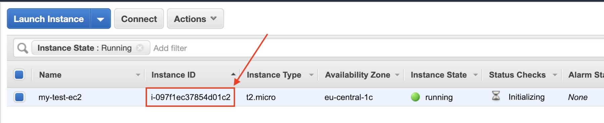
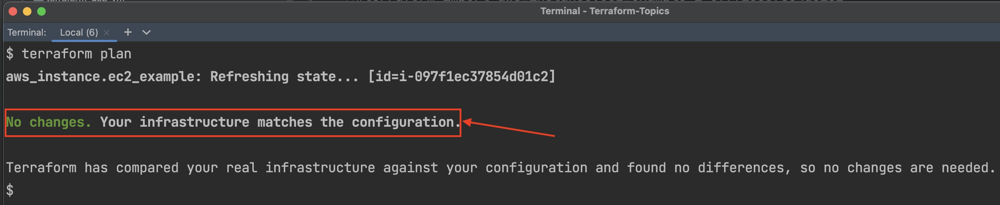
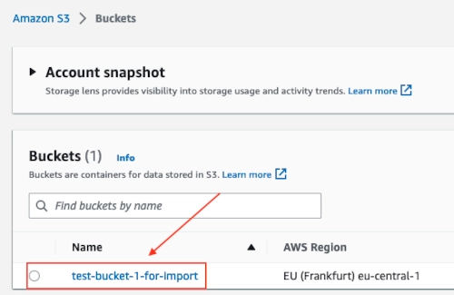
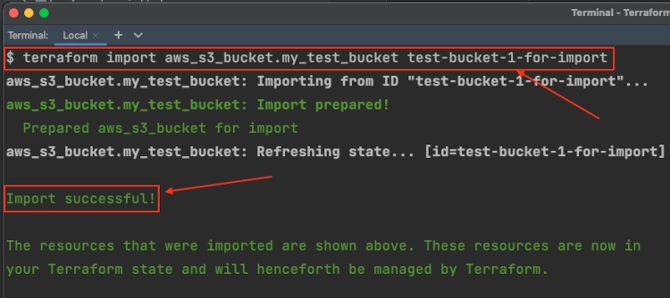
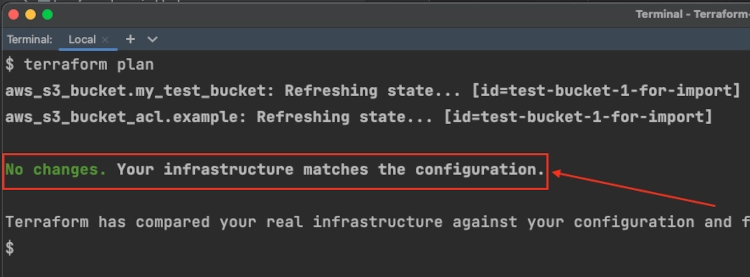

Terraform import is a command in HashiCorp Terraform used to bring existing infrastructure into Terraform's management. This command allows you to link resources created outside of Terraform (manually or by other tools) with Terraform resource blocks in your configuration files.

### Why Use terraform import?
Adopt existing resources: If you have manually created resources or used another tool to provision them, you can use terraform import to bring those resources under Terraform’s management without destroying and recreating them.
Gradual migration: It helps in incrementally adopting Terraform in an already running environment.

We will see in this lab?

1. How to import EC2 Instance?
2. How to import S3 Bucket?
3. How to import module?
Also, we are going to take a look on the -

In which situation you should use terraform import?
Drawbacks of Terraform import?
Always use terraform output during the terraform import

But before that here's the basic syntax for the terraform import command:
```t
# terraform import command to import resource 
terraform import <RESOURCE_TYPE>.<RESOURCE_NAME> <RESOURCE_ID> 
```
For example, if you want to import an existing Amazon S3 bucket into Terraform, you could use a command like this:
```t
terraform import aws_s3_bucket.my_bucket my-bucket-name 
```

Keep in mind that you will need to have a resource block in your Terraform configuration for the resource type you are importing. The resource block should include all of the required arguments for the resource type, as well as any optional arguments that you want to set.

Once you have imported the resource, you can use the standard Terraform workflow to make changes to the resource and apply those changes.

How to import EC2 Instance using Terraform import?
To import an Amazon EC2 instance into Terraform using the terraform import command, you will need to have a resource block in your Terraform configuration for the aws_instance resource type. The resource block should include all of the required arguments for the aws_instance resource, as well as any optional arguments that you want to set.

Here are the steps which you need to follow for import:

1. Identify the EC2 Instance- But first let's check the EC2 Instance which is already provisioned on AWS. Here is the screenshot of my EC2 Instance running on AWS


2. Write Empty aws_instance resource block- Write an empty terraform resource block for EC2 Instance:
```t
 #main.tf 

 provider "aws" {
   region     = "eu-central-1"
   shared_credentials_files = ["/Users/sumit/.aws/credentials"]
 }

 resource "aws_instance" "ec2_example" {
 }
```
3. Run terraform import- Now the terraform import command using the correct resource name .e.g. aws_instance.ec2_example
```t
 terraform import aws_instance.ec2_example i-097f1ec37854d01c2
```
4. Fill in the resource block- After the successful import add the EC2 resource information into the empty block of aws_instance:
```t
 resource "aws_instance" "ec2_example" {
   ami            = "ami-06ce824c157700cd2"
   instance_type  = "t2.micro"
   tags = {
     "Name" = "my-test-ec2"
   }
 }
```
5. Verify the import- Now you can verify the terraform import by running the command terraform plan and it should not create any more resources 


The above steps will import the EC2 instance with the ID i-097f1ec37854d01c2 into Terraform and create a resource block for it in your configuration. You can then use the standard Terraform workflow to make changes to the EC2 instance and apply those changes.

## How to import S3 Bucket using Terraform import?
Here are the steps which you need to follow for importing pre-existing S3 bucket using terraform import command -

1. Find the name of the bucket- The first step would be to find the name of the bucket which you want to import back using terraform import. Here is the bucket which I have created manually from the AWS GUI console 


2. Create empty aws_s3_bucket resource in main.tf- Create an empty aws_s3_bucket resource inside the terraform file(main.tf). Here is the code for empty aws_s3_bucket 
```t
resource "aws_s3_bucket" "my_test_bucket" {
  bucket = "test-bucket-1-for-import"
  tags = {
      "name" = "test-bucket"
    }
  }
```
Also, you need to create an empty resource for aws_s3_bucket_acl 
```t
resource "aws_s3_bucket_acl" "example" {
   bucket = aws_s3_bucket.my_test_bucket.id
}
```
3. Run terraform import- Now run the terraform import command for both the resources -
aws_s3_bucket
aws_s3_bucket_acl
```t
terraform import aws_s3_bucket.my_test_bucket test-bucket-1-for-import
```


4. Fill in the resource block- Now you can write the remaining terraform code inside your terraform file(main.tf) and execute the terraform plan command to verify that you have successfully imported all the resources.
```t
 # main.tf 

 resource "aws_s3_bucket" "my_test_bucket" {
   bucket = "test-bucket-1-for-import"
   tags = {
     "name" = "test-bucket"
   }
 }

 resource "aws_s3_bucket_acl" "example" {
   bucket = aws_s3_bucket.my_test_bucket.id
 }
```
5. Verify the import- Run the terraform plan command to verify the import and if you have successfully imported the resources then it should show the following message on your terminal "No changes. Your infrastructure matches the configuration." -


Great you have successfully imported the S3 bucket.

## How to import the module?
Importing a module can be a little challenging and it depends a lot on how big and complex the module is. But there are steps which I would recommend you follow -

1. Define the source of local module - You need to define a module block and specify the source of the module, like this:
```t
 module "example" {
   source = "./module-directory"
 }
```
The above code will import to the local directory module-directory.

2. Define the source of the remote module - specify a remote source for the module, such as a Git repository or a Terraform registry. You can use the registry name and the module name in the source field, like this:
```t
 module "example" {
   source = "registry.terraform.io/module/name"
 }
```
You can even define the version of the module also if in case you want to import any specific module version 
```t
module "example" {
   source = "registry.terraform.io/module/name/version"
 }
```
3. Reference the resources with the module- After defining the module in your configuration, you can use the resources and outputs defined in the module by referencing them using the module name and resource/output name, like this:
```t
 resource "aws_instance" "example" {
   ami           = module.example.ami_id
   instance_type = "t2.micro"
 }
```
Here is the output resource block -
```t
output "example_output" {
 value = module.example.output_value
}
```
4. Example command for module import- Here is an example command for importing the module but you need to modify the code based on the name of your module
```t
terraform import module.example.aws_s3_bucket.example BUCKET-NAME
```
### In which situation you should use terraform import?
There are a few situations where you might want to use the terraform import command:

1. When you want to bring existing infrastructure under Terraform management: If you have infrastructure that was created outside of Terraform, you can use terraform import to bring it under Terraform management. This allows you to use the standard Terraform workflow to make changes to the infrastructure and track those changes over time.

2. When you want to move infrastructure between environments: If you have the infrastructure in one environment (e.g. a staging environment) and you want to move it to another environment (e.g. production), you can use terraform import to bring the infrastructure into Terraform in the target environment, and then use the standard Terraform workflow to apply the changes.

3. When you want to switch from manual management to Terraform management: If you have been manually managing infrastructure and you want to switch to using Terraform, you can use terraform import to bring the existing infrastructure under Terraform management. This allows you to start using the standard Terraform workflow to manage the infrastructure going forward.

Keep in mind that terraform import is a one-time operation, and it should not be used as a replacement for the standard Terraform workflow. After you have imported a resource, you should continue to use the standard Terraform workflow to make changes to the resource.

### Drawbacks of terraform import?
1. It is a one-time operation: terraform import is a one-time operation, and it should not be used as a replacement for the standard Terraform workflow. After you have imported a resource, you should continue to use the standard Terraform workflow to make changes to it.

2. It can be difficult to use with complex infrastructure: terraform import can be difficult to use with infrastructure that has many dependencies or is otherwise complex. It may be easier to recreate the infrastructure from scratch using the standard Terraform workflow.

3. It does not import the resource's history: terraform import does not import the history of the resource, so you will not be able to see the changes that were made to the resource before it was brought under Terraform management.

### Always use terraform output during the terraform import
The output block in a Terraform configuration is used to define values that you want to be available after running Terraform. These outputs can be used to display important information about your infrastructure, or to pass values to other resources or modules.

A well-formatted terraform output block will help you to re-construct the resource block after you have successfully imported the terraform state using the terraform import command.